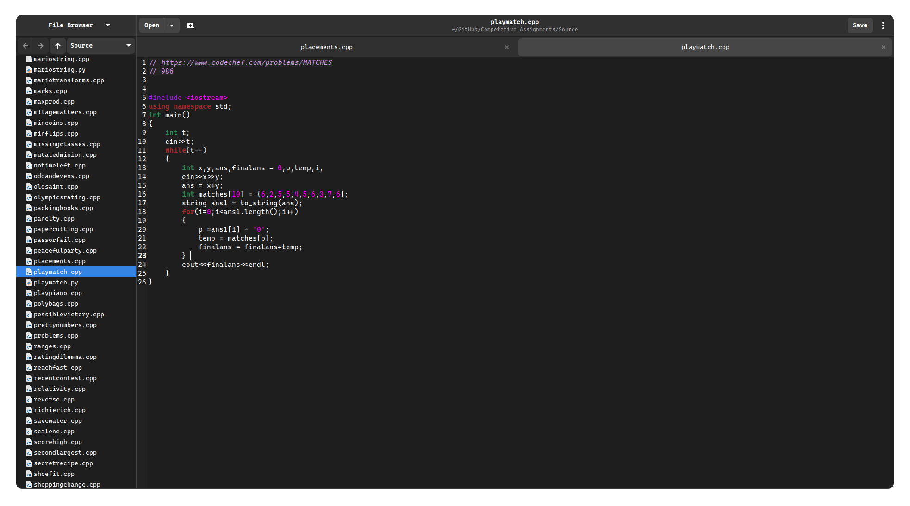
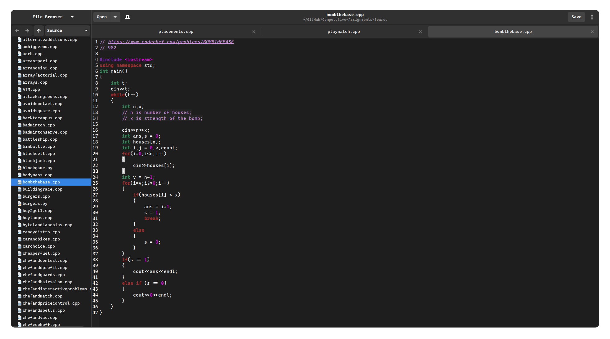
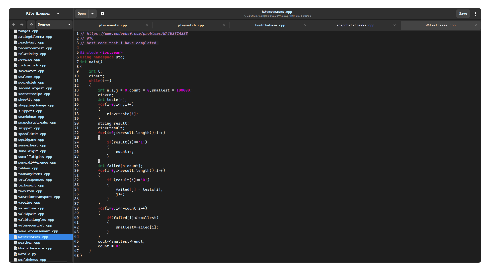
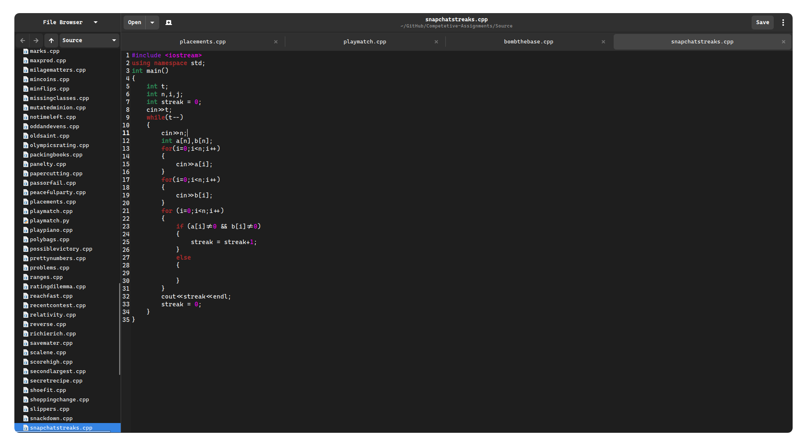

# Competetive-Assignments

This is my repository which contains all the question that I have solved from Competetive Programming. 
I have been trying to be as consistent as possible with competetive programming and I will be solving a lot of problems this year.

## What I use 
- VsCode  
- Gedit 
- Kitty *terminal*
- Website - [CodeChef](https://www.codechef.com/users/tanay_bhomia)

## Some of my favourite problems that I have solved 

1. Matches 

2. Bomb the Base

3. WA Test Cases

4. Snapchat Streaks

